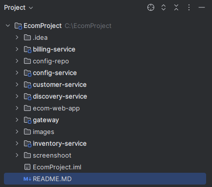
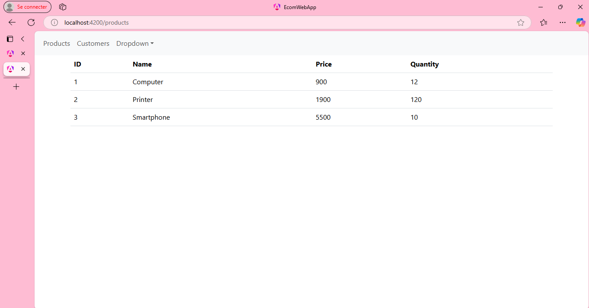
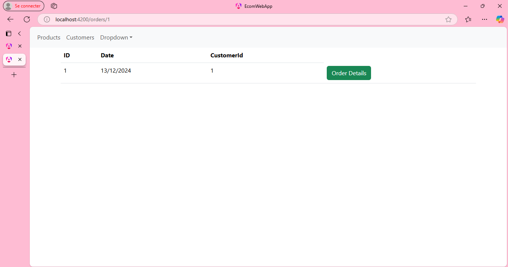
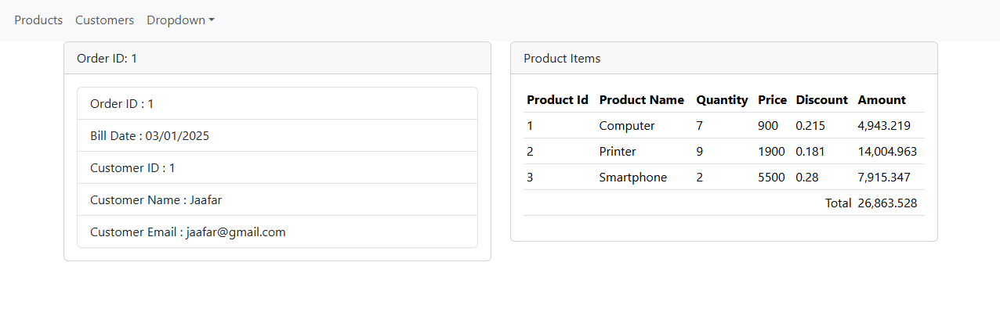

<h1>Tp 3</h1>

<h2>Architecture du Projet </h2>

<h2>Captures de l'execution </h2>

<h3> Ordre de l'execution</h3>

Dicovery, config, customer, inventory, gateway,billing

ensuite : cd ecom-web-app
puis : ng serve

